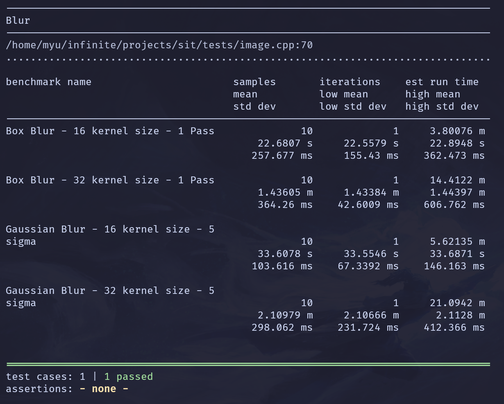
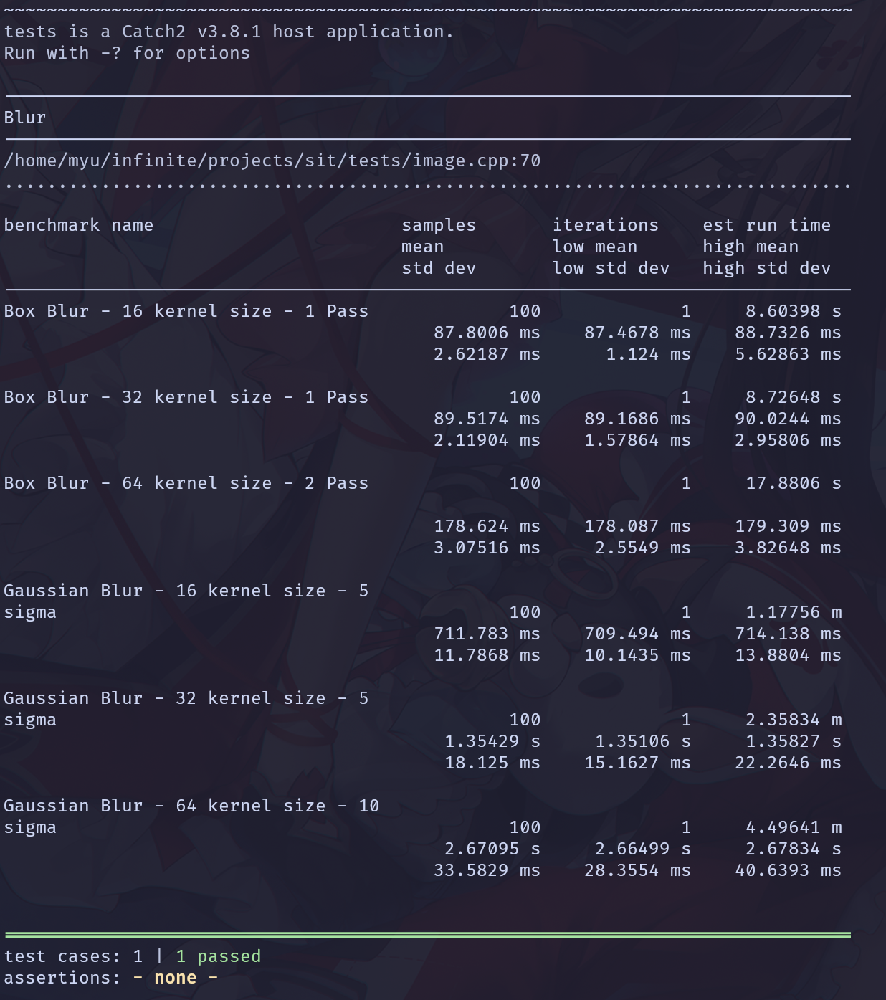

# Benchmarks

You can run benchmarks with `make benchmark`.

## Results

### Naive implementation

By applying the N by N kernel to each pixel, we can blur an image in
`O(height * width * n^2)`.

### 2 Pass implementation

For some 2D convolutions, we can break it down into two 1D convolutions, one in
each direction. (not so obvious, proof is required to show they are equivalent).

In this case, we only need to apply a 1D kernel (of size N), once in each
direction, which is `O(height * width * n)`.

We get a pretty significant speedup here.

- Box blur: 22.6807s -> 87.8006ms = 22680.7ms / 87.8006ms = 258.3x speedup
- Gaussian blur: 33.6078s -> 1.35429s = 33.6078s / 1.35429s = 24.8x speedup

We got a far better speedup with the box blur because we were able to apply a
sliding window approach, eliminating the need to apply the full kernel for each
pixel. In this case we only need to add/remove remove elements at the bounds of
our window. I couldn't find a obvious way to apply the same technique to the
gaussian blur due to the weights applied.

> Behold the power of big O
